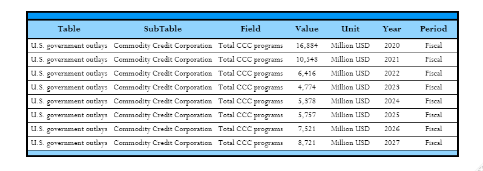

# Data Wrangling - PDF Table

The objective of this project is to become more accustomed to the pdftools package when trying to extract data from pdf files.

## PDF Table Example

## Cleaned Extracted Table

A portion of the whole data was selected to be represented below. It contains data from the U.S Gov't outlays and pertains to the field `Total CCC programs` of the subtable `Commodity Credit Corporations`.

### Citation
>Published by the Food and Agricultural Policy Research Institute (FAPRI) at the University of Missouri
(MU), 200 Mumford Hall, Columbia, MO 65211. FAPRI–MU is part of the Division of Applied Social
Sciences (DASS) in the College of Agriculture, Food and Natural Resources (CAFNR). 
https://www.fapri.missouri.edu/publication/2022_farm_income_update/
